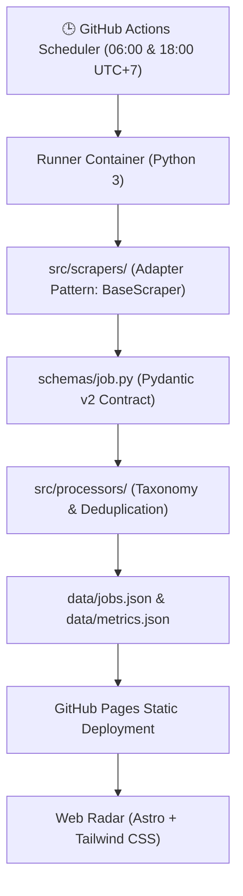

# 📡 VN Tech Job Radar (`vn-tech-job-radar`)

> **Automated GitHub Actions pipeline tracking Network, DevOps, SysAdmin, and IT Support roles in Vietnam.**  
> *Kiến trúc Serverless 0 đồng — Thu thập định kỳ, chuẩn hóa dữ liệu, loại bỏ tin trùng lặp và tự động phát hành qua GitHub Pages.*

[](https://python.org)
[](.memory/architecture.md)
[](LICENSE)
[](tests/)

---

## 🎯 Mục Tiêu Dự Án

Thực tập sinh và Fresher các ngành **Kỹ sư Mạng (Network)**, **IT Helpdesk**, **Quản trị Hệ thống (SysAdmin)** và **Cloud/DevOps** thường gặp khó khăn khi tìm kiếm cơ hội việc làm do:
- Tin tuyển dụng bị phân tán rải rác trên nhiều sàn hoặc hội nhóm mạng xã hội.
- Ma trận tin tuyển dụng gắn nhãn "Fresher" nhưng yêu cầu 2-3 năm kinh nghiệm thực tế.
- Tin tuyển dụng hết hạn nhưng vẫn hiển thị trên các sàn tìm kiếm.

**VN Tech Job Radar** giải quyết triệt để vấn đề trên bằng **Pipeline tự động hóa hoàn toàn**:
1. **Thu thập thông minh**: Quét định kỳ qua các API và cổng tuyển dụng chính thức của các doanh nghiệp/tập đoàn công nghệ viễn thông lớn tại Việt Nam.
2. **Sàng lọc đa tầng**: Tự động phân loại ngành nghề, chấm điểm độ phù hợp và loại bỏ triệt để các tin yêu cầu Seniority cao.
3. **Lọc trùng bằng Canonical Hash**: Ngăn chặn tình trạng cùng một tin tuyển dụng bị trùng lặp trên nhiều kênh.
4. **Vòng đời TTL tự động**: Tự động dọn dẹp các tin quá hạn (>30 ngày) để đảm bảo dữ liệu luôn tươi mới.

---

## 🏗️ Sơ Đồ Kiến Trúc Hệ Thống



---

## 📊 Phân Loại Kỹ Thuật (Target Roles)

| Nhóm Ngành | Mã Định Danh | Kỹ Năng / Từ Khóa Trọng Tâm |
| :--- | :--- | :--- |
| **Kỹ Sư Mạng (Network)** | `network` | CCNA, CCNP, Cisco, Mikrotik, Juniper, Routing, Switching, Firewall, TCP/IP |
| **IT Helpdesk & Support** | `helpdesk` | Desktop Support, Active Directory, LAN/WLAN, Cài đặt máy tính, IT Officer |
| **Quản Trị Hệ Thống** | `sysadmin` | Linux (Ubuntu/CentOS), Windows Server, MCSA, VMware, Virtualization |
| **Cloud & DevOps** | `devops` / `cloud` | Docker, Kubernetes, CI/CD, Terraform, Ansible, AWS, Azure, GCP, Bash |
| **An Ninh Mạng / SOC** | `security_soc` | SOC Tier 1, Giám sát SIEM, Incident Response, Network Security |

---

## 🗂️ Cấu Trúc Dự Án

```
├── .memory/                    # Bộ nhớ dự án & ADR do @tech-lead quản lý
│   ├── adr/                    # Biên bản quyết định kiến trúc
│   ├── architecture.md         # Nguồn chân lý kỹ thuật hệ thống
│   └── progress.md             # Bảng theo dõi tiến độ công việc
├── schemas/                    # Pydantic v2 Data Contracts
│   ├── __init__.py
│   └── job.py                  # JobPost, CompanyInfo, RadarMetrics
├── src/                        # Core Engine Ingestion
│   ├── scrapers/               # BaseScraper và các Scraper Adapters
│   └── processors/             # Phân loại từ khóa và Deduplication Engine
├── data/                       # Kho dữ liệu tĩnh (Git Database)
│   ├── jobs.json               # Dữ liệu việc làm đang kích hoạt
│   ├── metrics.json            # Thống kê phân tích kỹ năng
│   └── schema_jobs.json        # JSON Schema chuẩn hóa
├── tests/                      # Bộ kiểm thử tự động pytest
├── pyproject.toml              # Cấu hình dự án & công cụ kiểm thử
└── requirements.txt            # Thư viện phụ thuộc Python
```

---

## ⚡ Hướng Dẫn Cài Đặt & Chạy Kiểm Thử (3 Bước)

### Bước 1: Khởi tạo môi trường ảo
```bash
python3 -m venv .venv
source .venv/bin/activate
pip install -r requirements.txt
```

### Bước 2: Chạy kiểm thử tự động
```bash
pytest -v
```

### Bước 3: Xuất bản JSON Schema mới nhất
```bash
python -c "from schemas.job import export_json_schema; export_json_schema()"
```

---

## 🏛️ Quản Trị Dự Án & mowftee-guild

Dự án được xây dựng và quản trị theo quy chuẩn tác chiến của **`mowftee-guild`**:
- Quản lý kiến trúc & phân ranh giới: `@tech-lead`
- Xem chi tiết quyết định kỹ thuật tại: [.memory/architecture.md](.memory/architecture.md) và [.memory/adr/0001-khoi-tao-du-an.md](.memory/adr/0001-khoi-tao-du-an.md).

---

## 📄 Bản Quyền
Dự án được phát hành theo giấy phép [MIT](LICENSE).
